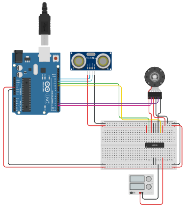

<h1 align="center">Sensor System</h1>

"Sensor System" is a final exam project for the "Sensor Systems" course at Singidunum University. The course was designed to teach students how to use sensors and micro-controllers to create a system that can be used to solve a real-world problem. To combine all the knowledge we learned during the course, we were tasked to create two projects. The first project was to be done using an Arduino micro-controller, while the second project was to be done using Python.

### Arduino Project

The Arduino was used to create a system that controls the speed of a motor depending on the distance from an object. To achieve this, we used an ultrasonic sensor to read the distance from an object, and depending on the distance, we would speed up or slow down the motor. The motor was connected to an optical encoder which was used to calculate the speed of the wheel attached to the motor. After reading the data, the speed (m/s) was printed out through the serial port.

### Image Processing Project

Python was used to perform different image processing tasks on a given image. The tasks were to create a gaussian blur filter that can be applied to an image, show the image in color, grayscale, as well as compute a histogram and CDF of the image. The project was done using Jupyter Notebook.

## 🧰 Languages & Tools

<a href="https://code.visualstudio.com/"></a>
<a href="https://www.arduino.cc/"></a>
<a href="https://www.python.org/"></a>
<a href="https://jupyter.org/"></a>

## ⚡ Getting Started - Arduino

### 🛠 Requirements:

#### Hardware:

- Arduino Uno Rev3
- HC-SR04 Ultrasonic sensor
- L293D H-Bridge
- Motor with optical encoder
- 12V Power Supply

#### Software:

- [Arduino IDE](https://www.arduino.cc/en/software/)

### 📖 Guide:

1. Follow the schematic below to connect your components:

    
2. Download ```ArduinoProject.ino``` file from the repository
3. Flash the code onto the Arduino
4. Enjoy 🙂

## ⚡ Getting Started - Jupyter

### 🛠 Requirements:

- [Python](https://www.python.org/downloads/)
- [Jupyter Notebook](https://jupyter.org/install)

### 📖 Guide:

1. Download the repository
2. Download and install Python
3. Download and install Jupyter Notebook
4. Execute ```> pip3 install numpy``` to install Numpy on your system
5. Execute ```> pip3 install matplotlib``` to install MatPlotLib on your system
6. Execute ```> jupyter notebook``` to run Jupyter
7. Open ```Python Image Processing.ipynb``` using Jupyter
8. Enjoy 🙂

## ⚖ License
This repository is not under any license. Normal copyright laws apply!
